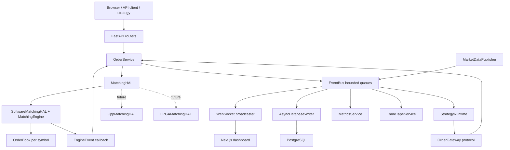
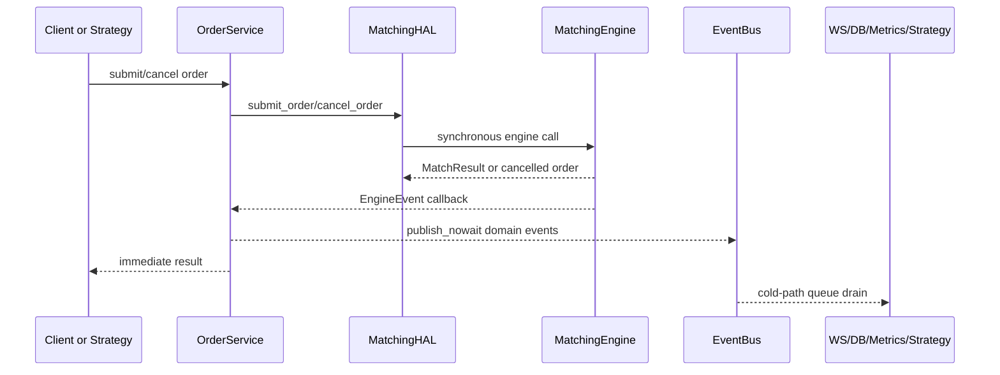

# Mini HFT System - Codex Agent Guide

Read this file before changing the repository. This project is a
latency-sensitive quantitative trading simulator with an intentional upgrade
path from Python to C++ and FPGA-backed matching. Preserve correctness,
determinism, and the hot-path latency model.

## Project Overview

Mini HFT System is a production-style low-latency trading infrastructure
project for education, portfolio demonstration, and future research. It models
the core services found around an exchange or internal crossing engine:

- Central Limit Order Book (CLOB) matching with price-time priority.
- Synchronous order submission and cancellation through a HAL boundary.
- In-process event fan-out to WebSockets, persistence, metrics, and strategies.
- Synthetic market data publishing for a live dashboard.
- Isolated strategy runtime with per-strategy risk controls and replay support.
- PostgreSQL persistence on a bounded asynchronous cold path.
- Next.js dashboard for book depth, trades, latency, strategies, and health.
- C++ and FPGA preparation layers through fixed-size binary frames and ring
  buffer abstractions.

Intended users are HFT infrastructure engineers, quant developers, systems
programmers, and AI coding agents working on low-latency trading systems.
The current stage is an advanced simulator/prototype: Python backend and
dashboard are functional, C++/FPGA paths are scaffolded, and live trading is not
implemented.

### High-Level Trading Workflow

1. A browser, test, or strategy submits an order through REST or the in-process
   `OrderGateway`.
2. `OrderService` converts API/domain objects and calls `MatchingHAL`.
3. `SoftwareMatchingHAL` currently delegates to the Python `MatchingEngine`.
4. The matching engine validates, matches, rests, cancels, or rejects orders
   synchronously.
5. The engine emits a synchronous `EngineEvent` callback.
6. `OrderService` translates the callback into domain events and publishes them
   with `EventBus.publish_nowait()`.
7. Cold-path consumers drain queues for WebSockets, database writes, metrics,
   trade tape projection, book deltas, and strategy execution.

### Core Capabilities

- Limit, market, IOC, FOK, and GTC/GTD order semantics.
- Price-time priority with maker-price execution.
- Order status and latency checkpoints in nanoseconds.
- Book snapshots and sequence-aware deltas.
- Trade tape and latency metrics (`p50`, `p99`, `p999`).
- Strategy lifecycle controls, kill switch, owned-order cancellation, PnL
  accounting, and deterministic replay.
- Bounded async persistence with retry and drop metrics.
- Fixed 64-byte wire frames for order/trade data.
- SPSC ring buffer abstraction for future shared-memory and DMA paths.

## System Architecture

### Component Diagram

### Event Flow

### Order Lifecycle

1. `Order` is created with `created_at_ns`.
2. `MatchingEngine.submit_order()` stamps `received_at_ns`.
3. `_validate()` rejects unknown symbols, duplicate IDs, invalid quantities, or
   invalid limit prices.
4. `OrderBook.submit()` matches against the opposite book using best price
   first, FIFO inside each price level.
5. Trades are appended to `MatchResult`; maker order status and taker status are
   mutated in place.
6. Residual limit quantity rests for GTC/GTD, cancels for IOC/FOK, and never
   rests for market orders.
7. `processed_at_ns` and `acked_at_ns` produce latency measurements.
8. Engine emits `ORDER_ACKED`, `ORDER_FILLED`, `ORDER_PARTIALLY_FILLED`,
   `ORDER_CANCELLED`, or `ORDER_REJECTED` plus book snapshots.

### Market-Data Lifecycle

1. `MarketDataPublisher` generates synthetic GBM ticker updates at the configured
   interval.
2. Matching events produce `BookSnapshot` values.
3. `BookDeltaProjector` sends `BOOK_SNAPSHOT` first and then sequenced
   `BOOK_DELTA` messages.
4. Clients detect sequence gaps and request a fresh snapshot rather than
   consuming full depth on every book change.

### Strategy Execution Lifecycle

1. `StrategyRuntime` subscribes to `BOOK_UPDATE` and `TRADE` events outside the
   matching stack.
2. Running strategies receive book/trade callbacks only for their symbol.
3. Strategy proposals are checked by `StrategyRiskGuard`.
4. Accepted orders are submitted through the narrow `OrderGateway`.
5. Runtime tracks owned orders, fills, realised/unrealised PnL, callback
   failures, risk rejections, and kill-switch activations.
6. `replay()` processes recorded domain events synchronously for deterministic
   testing and incident reconstruction.

## Technology Stack

- Backend: Python 3.11+, FastAPI, Pydantic v2, pydantic-settings, uvicorn.
- Matching: Python CLOB using `sortedcontainers.SortedDict`, dataclasses with
  `slots=True`, nanosecond timestamping.
- Hardware abstraction: `MatchingHAL`, `SoftwareMatchingHAL`, `CppMatchingHAL`
  scaffold, `FPGAMatchingHAL` scaffold.
- Binary protocol: Python `struct` codecs, fixed-size 64-byte order/trade
  frames, 16-byte book level frames, 32-byte snapshot headers.
- Messaging: in-process `EventBus` using bounded `asyncio.Queue`; SPSC ring
  buffer abstraction for latency-sensitive or hardware paths.
- Database: PostgreSQL 16, SQLAlchemy Core async engine, asyncpg, migration SQL
  in `infra/db/migrations/`.
- Frontend: Next.js 14, React 18, TypeScript, Tailwind CSS, Recharts.
- Testing: pytest, pytest-asyncio, httpx, C++ test scaffold, benchmark script in
  `tests/benchmarks/`.
- Deployment: Dockerfile for API, frontend Dockerfile, docker-compose for API,
  dashboard, and PostgreSQL.
- CI/CD: no `.github/workflows` directory is currently present.

## Repository Structure

- `api/`: FastAPI app, routers, dependency injection, DTOs, services, and
  WebSocket message/connection management.
- `api/routers/`: thin HTTP and WebSocket adapters for orders, market data,
  metrics, and strategies. Do not place business logic here.
- `api/services/`: application services bridging sync engine code to async
  infrastructure: order submission, book deltas, metrics, and trade tape.
- `api/websocket/`: browser-facing WebSocket schemas and connection manager.
- `engine/`: pure trading engine package. It must not depend on FastAPI,
  SQLAlchemy, asyncio service code, or frontend code.
- `engine/core/`: hot-path types, orders, trades, book, matching engine, binary
  protocol, protocols, and ring buffers.
- `engine/hal/`: hardware abstraction boundary. API/services talk to this layer,
  not directly to `MatchingEngine`.
- `engine/market_data/`: synthetic feed generation and publisher.
- `engine/risk/`: pre-trade risk checks for engine-level limits.
- `engine/transport/`: abstract ingress/egress transport boundaries.
- `engine/cpp/`: C++ CLOB scaffolding, CMake setup, pybind11 binding scaffold,
  and C++ tests.
- `shared/`: cross-package domain events and constants.
- `strategy/`: strategy base class, risk guard, event-driven runtime, and example
  market maker.
- `infra/config/`: runtime settings sourced from environment variables.
- `infra/db/`: SQLAlchemy schema, persistence serialization, async writer, and
  database migrations.
- `frontend/`: Next.js trading dashboard.
- `tests/`: engine, API, infra, strategy, HAL conformance, and benchmark tests.
- `docs/`: architecture and migration documentation, including FPGA design.
- `.codex/`: Codex-specific project memory and operating instructions.
- `.claude/`: Claude Code workspace/configuration area.
- `CLAUDE.md`: Claude-specific repository guidance.
- `Dockerfile`, `docker-compose.yml`, `requirements.txt`, `pyproject.toml`:
  packaging, local development, and deployment configuration.

## Development Workflow

### Local Development

1. Create a Python 3.11+ virtual environment.
2. Install backend dependencies with `pip install -r requirements.txt`.
3. Copy `.env.example` to `.env` and adjust database or feature flags.
4. Run the API with `uvicorn api.main:app --reload`.
5. For the dashboard, run `npm install` and `npm run dev` in `frontend/`.
6. Docker users can run the full stack with `docker-compose up --build`.

### Testing

- Run all Python tests with `pytest tests/ -v`.
- Run focused hot-path tests before and after any engine change:
  `pytest tests/engine -v`.
- Run API tests for router/service changes: `pytest tests/api -v`.
- Run persistence tests for database writer changes: `pytest tests/infra -v`.
- Run strategy tests for strategy runtime changes: `pytest tests/strategy -v`.
- Run benchmark scenarios after any matching, binary codec, ring buffer, or HAL
  change: `python tests/benchmarks/benchmark_engine.py --rounds 2000`.
- Frontend changes should pass `npm run type-check` and a production build from
  `frontend/`.

### Feature Implementation

- Read the target module and tests before editing.
- Keep routers thin; add behavior in services or domain modules.
- Prefer existing abstractions over new framework layers.
- Update tests with the smallest coverage that proves the behavior.
- For public API or WebSocket contract changes, update frontend types and tests.
- For persistence changes, preserve idempotent writes and bounded queues.

### Performance Validation

- Benchmark before and after modifying `engine/core/order_book.py`,
  `engine/core/matching_engine.py`, `engine/core/binary_protocol.py`,
  `engine/core/ring_buffer.py`, or any HAL implementation.
- Record p50/p99/p999 and throughput when reporting hot-path changes.
- Treat latency regressions as correctness bugs unless the user explicitly
  accepts the tradeoff.

## Deployment Workflow

### Build Process

- API container builds from root `Dockerfile` and runs `uvicorn`.
- Frontend container builds from `frontend/Dockerfile`.
- Compose starts API, frontend, and PostgreSQL with migrations mounted into
  `/docker-entrypoint-initdb.d`.

### Environment Configuration

- Main variables live in `.env.example`.
- Important settings include `DATABASE_URL`, `PERSISTENCE_ENABLED`,
  `EVENT_QUEUE_DEPTH`, `MARKET_DATA_TICK_INTERVAL_MS`, `CORS_ORIGINS`, and
  `LOG_LEVEL`.
- Keep secrets out of git.

### Production Deployment

- Replace reload-enabled commands with non-reload process managers.
- Disable dev volume mounts.
- Use managed PostgreSQL or hardened self-hosted PostgreSQL.
- Configure CORS to trusted dashboard origins only.
- Add CI/CD before production promotion; none exists today.

### Monitoring

- Existing runtime metrics expose order counts, trade counts, volume, latency
  percentiles, event bus drops, persistence drops/failures, and strategy
  callback failures.
- Production monitoring should add Prometheus/OpenTelemetry, structured logs on
  cold paths, database health, WebSocket fan-out health, queue depths, and HAL
  backend health.
- FPGA deployments should add PCIe link state, DMA ring utilization, hardware
  counters, thermal data, and bitstream/version checks.

## Performance Constraints

### Low-Latency Requirements

- The hot path is `order_in -> validate -> match -> result_out`.
- `engine/core/` must remain synchronous and free of I/O.
- Do not add `await`, database calls, network calls, filesystem I/O, logging, or
  external calls with unknown latency in the matching path.
- The only allowed side effect from engine callback flow is non-blocking queue
  publication (`put_nowait`-style).

### Deterministic Behavior Requirements

- Preserve price-time priority.
- Preserve maker-price execution.
- Preserve order status transitions and TIF semantics.
- Preserve nanosecond timestamp checkpoints.
- Preserve sequence numbers for book snapshots and deltas.
- Strategy replay must remain deterministic for the same ordered event stream.

### Throughput Considerations

- Current Python targets are simulator scale. Benchmarks document roughly
  thousands of orders per second, with p99 in microseconds to low milliseconds
  depending on scenario.
- C++ target is sub-5 microsecond p99 and hundreds of thousands of orders/sec.
- FPGA target is sub-microsecond to low-microsecond end-to-end depending on
  ingress and DMA path.
- Use bounded queues so slow cold-path consumers shed events rather than
  delaying order acknowledgement.

### Memory Considerations

- Use `@dataclass(slots=True)` for per-order/per-trade hot-path structures.
- Avoid dict/list/string allocation in hot loops and wire-facing structs.
- Prefer fixed-size binary frames for process or hardware boundaries.
- Avoid unbounded queues and unbounded historical lists.
- Be careful with percentile calculations that sort samples on demand.

## Quantitative Trading Constraints

- Do not introduce blocking operations into critical paths.
- Minimize allocations in hot loops.
- Preserve the event-driven architecture.
- Avoid unnecessary abstractions in latency-sensitive code.
- Benchmark before modifying matching logic.
- Keep the HAL seam intact: services depend on `MatchingHAL`, not
  `MatchingEngine`.
- Keep `engine/` independent of `api/`, `infra/`, and frontend packages.
- Use `time.time_ns()` for engine and event timestamps.
- Keep binary protocol frames fixed-size and cache-line/DMA friendly.
- Do not use JSON, pickle, or variable-length encodings for future
  inter-process or hardware-bound hot paths.
- Never allow strategy failures to enter the matching call stack.
- Do not make persistence or WebSocket fan-out part of order acknowledgement.

## Component Inventory

- Matching Engine: `engine/core/matching_engine.py`,
  `engine/core/order_book.py`.
- Order Management: `api/services/order_service.py`,
  `api/routers/orders.py`.
- Market Data Pipeline: `engine/market_data/`, `api/services/book_stream_service.py`,
  `api/routers/market_data.py`.
- Strategy Framework: `strategy/base.py`, `strategy/runtime.py`,
  `strategy/risk.py`, `strategy/examples/market_maker.py`.
- Event System: `shared/events.py`.
- Database Layer: `infra/db/`.
- Dashboard/UI: `frontend/`.
- APIs: `api/main.py`, `api/routers/`.
- WebSocket Infrastructure: `api/websocket/`, `api/main.py` broadcast loops.
- Latency Monitoring: `engine/core/order.py`, `engine/core/matching_engine.py`,
  `api/services/metrics_service.py`, `frontend/src/components/LatencyChart.tsx`.
- Simulation/Paper Trading: synthetic `MarketDataPublisher`, strategy runtime,
  deterministic replay. No broker-connected paper trading adapter yet.
- FPGA/Hardware-Abstraction: `engine/hal/`, `engine/core/binary_protocol.py`,
  `engine/core/ring_buffer.py`, `engine/cpp/`, `docs/fpga_acceleration_design.md`.

## Codex Operating Rules

- Make the smallest change that satisfies the task.
- Preserve trading behavior unless the user explicitly asks for a behavior
  change.
- Treat tests and benchmarks as part of the contract.
- Before editing hot-path code, inspect related tests and benchmark baselines.
- After documentation-only changes, run at least `pytest tests/ -v` when
  practical to prove functionality was not disturbed.
- When changing frontend code, run type-check/build and visually verify the
  local app when feasible.
- Do not remove existing docs unless they are migrated into the appropriate
  agent-specific file.
- Keep this file Codex-specific. Put Claude-specific instructions in
  `CLAUDE.md` or `.claude/`.

## Future Roadmap

- Paper trading adapter with simulated broker fills and account state.
- Live trading integration behind explicit safety gates and broker/exchange
  adapters.
- Stronger risk management: global kill switch, fat-finger checks, position and
  notional caps, order-rate throttles, max loss, self-trade prevention, and
  per-strategy circuit breakers.
- Durable event journal/replay system for recovery and research.
- Research environment for backtests, parameter sweeps, and strategy evaluation.
- Strategy marketplace or plugin registry with sandboxing and strict capability
  boundaries.
- C++ matching backend with arena allocation and pybind11 integration.
- FPGA acceleration with hugepage DMA rings, busy polling, hardware risk checks,
  hardware feed parsing, and health telemetry.
- Advanced analytics: slippage, queue position, adverse selection, inventory
  risk, fee modeling, and latency attribution.
- CI/CD with Python tests, frontend type/build checks, Docker build validation,
  benchmark trend reporting, and static analysis.
